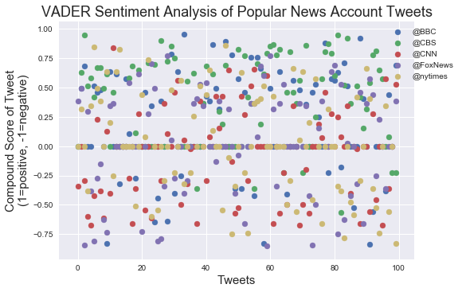
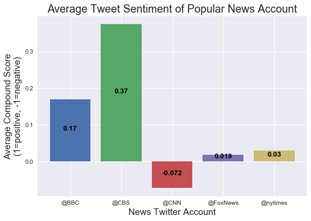

```python
Observation Trend 1: CBS seems to have the most positive sentiment score followed by BBC
Observation Trend 2: CNN seems to have the most negative sentiment score
Observation Trend 3: Fox news and NYtimes seems to be having a close to a neutral score
```


```python
import pandas as pd
import seaborn as sns
import numpy as np
import tweepy
import matplotlib.pyplot as plt
from datetime import datetime
from vaderSentiment.vaderSentiment import SentimentIntensityAnalyzer
analyzer = SentimentIntensityAnalyzer()
```


```python
consumer_key = "qWjW9sU3TXSmxK1K99cTKg21w"
consumer_secret = "efw3jTAtQ2YrMsEJK68C2HWCwbUgAH5tPq3aeu2e3cMJ16M6qb"
access_token = "932691218248622080-b6ji2lUfPUDLFEdPxHFDtz8c4Z3tgVg"
access_token_secret = "wHcODgWa0WRPxQu6OPdokd0p6uQjNH7LWvkUUHo132HBw"
```


```python
auth = tweepy.OAuthHandler(consumer_key, consumer_secret)
auth.set_access_token(access_token, access_token_secret)
api = tweepy.API(auth, parser=tweepy.parsers.JSONParser())
```


```python
twitter_accounts = ('@BBC', '@CBS', '@CNN', '@FoxNews', '@nytimes')
sentiments = []

for account in twitter_accounts:
    
    # gather tweets from news accounts
    news_tweets = api.user_timeline(id=account, count =100)
    
    # set tweet counter
    tweet_count = 100
    
    # loop through tweets
    for tweet in news_tweets:
        
        # retrive timestamp of tweet
        timestamp = tweet['created_at']
        tweet_date = datetime.strptime(timestamp, '%a %b %d %H:%M:%S %z %Y').date()
        
        # retrive tweet text
        text = tweet['text']
        
        # analyze tweet
        scores = analyzer.polarity_scores(text)
        
        # add news account to scores dictionary
        scores['News_Source'] = account
        
        # add date to scores dictionary
        scores['Date'] = converted_timestamp
        
        # add tweet Number to scores dictionary
        scores['Tweet_Number'] = tweet_count
        tweet_count -= 1
        
        # add scores dictionary to sentiments list
        sentiments.append(scores)

# create dataframe with tweet data
news_sentiment_df = pd.DataFrame(sentiments)
news_sentiment_df.head()
```


<div>
<style>
    .dataframe thead tr:only-child th {
        text-align: right;
    }

    .dataframe thead th {
        text-align: left;
    }

    .dataframe tbody tr th {
        vertical-align: top;
    }
</style>
<table border="1" class="dataframe">
  <thead>
    <tr style="text-align: right;">
      <th></th>
      <th>Date</th>
      <th>News_Source</th>
      <th>Tweet_Number</th>
      <th>compound</th>
      <th>neg</th>
      <th>neu</th>
      <th>pos</th>
    </tr>
  </thead>
  <tbody>
    <tr>
      <th>0</th>
      <td>2017-12-10</td>
      <td>@BBC</td>
      <td>100</td>
      <td>0.6915</td>
      <td>0.000</td>
      <td>0.560</td>
      <td>0.440</td>
    </tr>
    <tr>
      <th>1</th>
      <td>2017-12-10</td>
      <td>@BBC</td>
      <td>99</td>
      <td>0.0000</td>
      <td>0.000</td>
      <td>1.000</td>
      <td>0.000</td>
    </tr>
    <tr>
      <th>2</th>
      <td>2017-12-10</td>
      <td>@BBC</td>
      <td>98</td>
      <td>0.4391</td>
      <td>0.000</td>
      <td>0.855</td>
      <td>0.145</td>
    </tr>
    <tr>
      <th>3</th>
      <td>2017-12-10</td>
      <td>@BBC</td>
      <td>97</td>
      <td>-0.3818</td>
      <td>0.126</td>
      <td>0.874</td>
      <td>0.000</td>
    </tr>
    <tr>
      <th>4</th>
      <td>2017-12-10</td>
      <td>@BBC</td>
      <td>96</td>
      <td>0.0000</td>
      <td>0.000</td>
      <td>1.000</td>
      <td>0.000</td>
    </tr>
  </tbody>
</table>
</div>


```python
pivoted_df = news_sentiment_df.pivot(index='Tweet_Number', columns='News_Source', values='compound')
pivoted_df.head()
```


<div>
<style>
    .dataframe thead tr:only-child th {
        text-align: right;
    }

    .dataframe thead th {
        text-align: left;
    }

    .dataframe tbody tr th {
        vertical-align: top;
    }
</style>
<table border="1" class="dataframe">
  <thead>
    <tr style="text-align: right;">
      <th>News_Source</th>
      <th>@BBC</th>
      <th>@CBS</th>
      <th>@CNN</th>
      <th>@FoxNews</th>
      <th>@nytimes</th>
    </tr>
    <tr>
      <th>Tweet_Number</th>
      <th></th>
      <th></th>
      <th></th>
      <th></th>
      <th></th>
    </tr>
  </thead>
  <tbody>
    <tr>
      <th>1</th>
      <td>0.0000</td>
      <td>0.0000</td>
      <td>-0.3400</td>
      <td>0.3818</td>
      <td>0.0000</td>
    </tr>
    <tr>
      <th>2</th>
      <td>0.4939</td>
      <td>0.6289</td>
      <td>0.0000</td>
      <td>0.4939</td>
      <td>0.3182</td>
    </tr>
    <tr>
      <th>3</th>
      <td>0.6808</td>
      <td>0.9476</td>
      <td>-0.2960</td>
      <td>-0.8442</td>
      <td>0.0000</td>
    </tr>
    <tr>
      <th>4</th>
      <td>0.0000</td>
      <td>0.5106</td>
      <td>-0.5994</td>
      <td>0.2960</td>
      <td>-0.3818</td>
    </tr>
    <tr>
      <th>5</th>
      <td>0.0000</td>
      <td>0.5826</td>
      <td>-0.6705</td>
      <td>-0.3818</td>
      <td>0.3400</td>
    </tr>
  </tbody>
</table>
</div>


```python
x_values = np.arange(100)


for news_source in twitter_accounts:
    
    plt.scatter(x_values, pivoted_df[news_source])

# legend
plt.legend(loc='upper right', bbox_to_anchor=(1.13, 1))

# title and axis labels
plt.title('VADER Sentiment Analysis of Popular News Account Tweets', fontsize=18)
plt.xlabel('Tweets', fontsize=15)
plt.ylabel('Compound Score of Tweet\n(1=positive, -1=negative)', fontsize=15)

# save plot
plt.savefig('sentiment_analysis_scatter.png')

plt.show()
```





```python
grouped_df = news_sentiment_df.groupby('News_Source')

# calculate mean on compound scores
grouped_compound = grouped_df['compound'].mean()
grouped_compound
```


    News_Source
    @BBC        0.170004
    @CBS        0.374197
    @CNN       -0.072207
    @FoxNews    0.018619
    @nytimes    0.029772
    Name: compound, dtype: float64


```python
x_values = np.arange(len(twitter_accounts))

plot_data = zip(x_values, twitter_accounts)

for x, news_source in plot_data:
    
    y = grouped_compound[news_source]
    
    plt.bar(x, y)
    
    plt.text(x, y/2, '{:.2}'.format(y),
             horizontalalignment='center', color='black',
             fontsize=12, weight='bold')
    
# change xticks to news sources
plt.xticks(x_values, twitter_accounts)


# title and axis labels
plt.title('Average Tweet Sentiment of Popular News Account', fontsize=18)
plt.xlabel('News Twitter Account', fontsize=15)
plt.ylabel('Average Compound Score\n(1=positive, -1=negative)', fontsize=15)

# save plot
plt.savefig('average_sentiment_bar.png')

plt.show()
```





```python

```
